<p align="center">
  <h1 align="center">🏦 Bank Customer Churn Predictor</h1>
</p>

<p align="center">
  <em>Predicting customer attrition in the banking industry using ensemble machine learning — so banks can act before customers leave.</em>
</p>

<p align="center">
  <a href="#"></a>
  <a href="#"></a>
  <a href="#"></a>
  <a href="#"></a>
  <a href="#"></a>
  <a href="#"></a>
</p>

<p align="center">
  <a href="#-the-elevator-pitch">Elevator Pitch</a> •
  <a href="#-key-features">Key Features</a> •
  <a href="#%EF%B8%8F-tech-stack">Tech Stack</a> •
  <a href="#-architecture--data-pipeline">Architecture</a> •
  <a href="#-getting-started">Getting Started</a> •
  <a href="#-usage">Usage</a> •
  <a href="#-project-structure">Project Structure</a> •
  <a href="#-results">Results</a> •
  <a href="#-roadmap--contributing">Roadmap</a> •
  <a href="#-license--contact">License</a>
</p>

---

## 🎯 The Elevator Pitch

Customer churn is the silent profit killer in banking. Every lost customer represents a significant hit to revenue, and acquiring a new customer costs **5–25x more** than retaining an existing one.

**Bank Customer Churn Predictor** tackles this head-on by analyzing **10,000+ customer records** across 12 behavioral and demographic features — from credit scores to account activity — to predict which customers are most likely to leave. Using an ensemble of **5 industry-grade ML models** and rigorous hyperparameter optimization, this project delivers **86.5% prediction accuracy**, empowering proactive retention strategies.

> **💡 Business Impact:** With this model, a bank with 1 million customers could potentially identify and retain thousands of at-risk accounts, translating to millions in preserved revenue.

---

## ✨ Key Features

| Feature | Description |
|:---|:---|
| 🤖 **Multi-Model Ensemble** | Compares 5 algorithms — Logistic Regression, Random Forest, Gradient Boosting, XGBoost & LightGBM — to find the optimal predictor |
| 🔬 **Automated Hyperparameter Tuning** | Uses `RandomizedSearchCV` across massive parameter spaces, evaluating hundreds of configurations per model |
| 📊 **Rich Exploratory Analysis** | 10+ visualizations including correlation heatmaps, distribution plots, and churn-segmented analyses |
| 🎯 **86.5% Accuracy** | Gradient Boosting delivers the highest accuracy after exhaustive tuning |
| ⚡ **10x Faster Tuning** | LightGBM achieves comparable accuracy (86.31%) in only **9.4 seconds** vs. Gradient Boosting's 35+ minutes |
| 💾 **Production-Ready Export** | Best model serialized via `pickle` for instant deployment and inference |
| 📈 **Feature Engineering** | Label encoding for categorical variables, train-test splitting, and comprehensive data preprocessing |

---

## 🛠️ Tech Stack

<table>
  <tr>
    <th>Category</th>
    <th>Technologies</th>
  </tr>
  <tr>
    <td><strong>Language</strong></td>
    <td>
      
    </td>
  </tr>
  <tr>
    <td><strong>Data Manipulation</strong></td>
    <td>
      
      
    </td>
  </tr>
  <tr>
    <td><strong>Visualization</strong></td>
    <td>
      
      
    </td>
  </tr>
  <tr>
    <td><strong>Machine Learning</strong></td>
    <td>
      
      
      
    </td>
  </tr>
  <tr>
    <td><strong>Model Serialization</strong></td>
    <td>
      
    </td>
  </tr>
  <tr>
    <td><strong>Environment</strong></td>
    <td>
      
      
    </td>
  </tr>
</table>

---

## 🏗 Architecture & Data Pipeline

```mermaid
flowchart LR
    A["📥 Raw Data\n(Kaggle CSV)\n10K rows × 12 cols"] --> B["🔍 EDA\n& Visualization"]
    B --> C["⚙️ Preprocessing\n• Label Encoding\n• Train/Test Split"]
    C --> D["🤖 Model Training\n• Logistic Regression\n• Random Forest\n• Gradient Boosting\n• XGBoost\n• LightGBM"]
    D --> E["🎛 Hyperparameter\nTuning\n(RandomizedSearchCV)"]
    E --> F["📊 Model\nComparison\n& Selection"]
    F --> G["💾 Best Model\nExport\n(Pickle)"]

    style A fill:#E3F2FD,stroke:#1565C0,color:#000
    style B fill:#FFF3E0,stroke:#E65100,color:#000
    style C fill:#E8F5E9,stroke:#2E7D32,color:#000
    style D fill:#F3E5F5,stroke:#6A1B9A,color:#000
    style E fill:#FCE4EC,stroke:#AD1457,color:#000
    style F fill:#FFFDE7,stroke:#F57F17,color:#000
    style G fill:#E0F7FA,stroke:#00695C,color:#000
```



### Pipeline Breakdown

1. **Data Ingestion** — Customer records loaded from a Kaggle CSV dataset containing 10,000 banking customers with 12 features including demographics, financial profiles, and behavioral indicators.

2. **Exploratory Data Analysis** — Comprehensive visual analysis reveals key patterns:
   - Gender-based churn distribution
   - Age-based churn segmentation
   - Credit score correlation with churn
   - Feature correlation heatmaps
   - Missing value analysis (dataset is clean — zero nulls)

3. **Preprocessing** — Categorical features (`country`, `gender`) are encoded via `LabelEncoder`. Data is split into training and testing sets.

4. **Multi-Model Training** — Five classification algorithms are trained and evaluated on accuracy metrics.

5. **Hyperparameter Optimization** — `RandomizedSearchCV` searches across vast parameter grids for each model, optimizing for accuracy.

6. **Model Export** — The best-performing model is serialized via `pickle` for production deployment.

---

## 🚀 Getting Started

### Prerequisites

Ensure you have the following installed:

| Prerequisite | Version | Purpose |
|:---|:---|:---|
| Python | 3.10+ | Runtime environment |
| pip | Latest | Package management |
| Jupyter Notebook / Google Colab | — | Interactive execution |

### Installation

```bash
# 1. Clone the repository
git clone https://github.com/SukeshShetty1010/Bank_Churn_Predictor.git

# 2. Navigate into the project directory
cd Bank_Churn_Predictor

# 3. (Optional) Create a virtual environment
python -m venv venv
source venv/bin/activate        # Linux / macOS
venv\Scripts\activate           # Windows

# 4. Install dependencies
pip install numpy pandas matplotlib seaborn scikit-learn xgboost lightgbm
```

### Dataset

The dataset is sourced from Kaggle: [**Bank Customer Churn Dataset**](https://www.kaggle.com/datasets/gauravtopre/bank-customer-churn-dataset)

Download the CSV and update the `file_path` variable in the notebook to point to your local copy.

<details>
<summary>📋 <strong>Dataset Features Reference</strong></summary>

| # | Feature | Type | Description |
|---|:---|:---|:---|
| 1 | `customer_id` | int | Unique customer identifier |
| 2 | `credit_score` | int | Customer's credit score (350–850) |
| 3 | `country` | str | Country of residence (France, Spain, Germany) |
| 4 | `gender` | str | Male / Female |
| 5 | `age` | int | Customer age |
| 6 | `tenure` | int | Years as a bank customer |
| 7 | `balance` | float | Account balance |
| 8 | `products_number` | int | Number of bank products used |
| 9 | `credit_card` | int | Has credit card (1=Yes, 0=No) |
| 10 | `active_member` | int | Is active member (1=Yes, 0=No) |
| 11 | `estimated_salary` | float | Estimated annual salary |
| 12 | `churn` | int | **Target** — Left the bank (1=Yes, 0=No) |

</details>

---

## 💻 Usage

### Running the Notebook

**Option A: Google Colab (Recommended)**
1. Upload `Bank_Customer_Churn_Prediction.ipynb` to [Google Colab](https://colab.research.google.com/)
2. Upload the dataset CSV to your Google Drive
3. Update the `file_path` variable to match your Drive path
4. Run all cells sequentially (`Runtime → Run All`)

**Option B: Local Jupyter**
```bash
jupyter notebook Bank_Customer_Churn_Prediction.ipynb
```

### Loading the Saved Model for Predictions

```python
import pickle
import numpy as np

# Load the trained model
with open('path/to/saved_model.pkl', 'rb') as f:
    model = pickle.load(f)

# Predict churn for a new customer
# Features: credit_score, country, gender, age, tenure, balance,
#           products_number, credit_card, active_member, estimated_salary
new_customer = np.array([[650, 0, 1, 35, 5, 75000.00, 2, 1, 1, 50000.00]])
prediction = model.predict(new_customer)

print("Churn Prediction:", "Will Churn ⚠️" if prediction[0] == 1 else "Will Stay ✅")
```

---

## 📂 Project Structure

```
Bank_Churn_Predictor/
│
├── 📓 Bank_Customer_Churn_Prediction.ipynb   # Main notebook — full ML pipeline
│   ├── Problem definition & data loading
│   ├── Exploratory Data Analysis (EDA)
│   │   ├── Gender vs. Churn (count plots)
│   │   ├── Age distribution by Churn (histograms)
│   │   ├── Credit Score distribution by Churn
│   │   └── Correlation Heatmap
│   ├── Data Preprocessing
│   │   ├── Missing value checks
│   │   ├── Label Encoding (country, gender)
│   │   └── Train / Test split
│   ├── Model Training & Evaluation
│   │   ├── Logistic Regression
│   │   ├── Random Forest
│   │   ├── Gradient Boosting
│   │   ├── XGBoost
│   │   └── LightGBM
│   ├── Hyperparameter Tuning (RandomizedSearchCV)
│   ├── Model Comparison (bar chart)
│   └── Model Serialization (pickle)
│
└── 📄 README.md                              # This file
```

---

## 📊 Results

### Model Performance Comparison

| Model | Best Accuracy | Tuning Time | Key Parameters |
|:---|:---:|:---:|:---|
| **Gradient Boosting** 🏆 | **86.50%** | ~35 min | `lr=0.01, depth=7, n=558` |
| LightGBM ⚡ | 86.31% | **~9 sec** | `lr=0.05, depth=15, leaves=31` |
| XGBoost | 86.25% | ~14 min | `lr=0.1, depth=3, n=400` |
| Random Forest | 86.15% | ~58 sec | `n=300, depth=20, min_leaf=4` |

> **Key Insight:** While Gradient Boosting edges out the competition in raw accuracy, **LightGBM** delivers nearly identical performance (~0.2% difference) in a fraction of the time — making it the superior choice for production environments where training speed matters.

### Key Findings from EDA

- 📌 **Age** is a strong churn predictor — customers aged **40–60** show significantly higher churn rates
- 📌 **Gender** influences churn — **female** customers churn at a higher rate than males
- 📌 **Active membership** is inversely correlated with churn — inactive members are far more likely to leave
- 📌 **Number of products** — customers with **3+ products** exhibit higher churn rates
- 📌 The dataset is **clean** — zero missing values across all 10,000 records

---

## 🗺 Roadmap & Contributing

### Future Enhancements

- [ ] 🔧 **Feature Engineering** — Create interaction features (e.g., balance-to-salary ratio)
- [ ] 🧠 **Deep Learning** — Add neural network baseline (e.g., TabNet)
- [ ] 📊 **SHAP Analysis** — Explainability layer to interpret model predictions
- [ ] 🌐 **Web Dashboard** — Interactive Streamlit / Gradio app for real-time predictions
- [ ] 🐳 **Dockerized API** — Flask / FastAPI endpoint for model serving
- [ ] ⚖️ **Class Imbalance Handling** — Implement SMOTE or class-weighted training

### Contributing

Contributions are welcome! Here's how you can help:

1. **Fork** the repository
2. **Create** a feature branch (`git checkout -b feature/amazing-feature`)
3. **Commit** your changes (`git commit -m 'Add amazing feature'`)
4. **Push** to the branch (`git push origin feature/amazing-feature`)
5. **Open** a Pull Request

---

## 📜 License & Contact

This project is open source and available under the **MIT License**.

<p align="center">
  <strong>Built by <a href="https://github.com/SukeshShetty1010">Sukesh Shetty</a></strong>
</p>

<p align="center">
  <a href="https://github.com/SukeshShetty1010"></a>
</p>

---

<p align="center">
  <sub>⭐ If you found this project useful, consider giving it a star! ⭐</sub>
</p>
